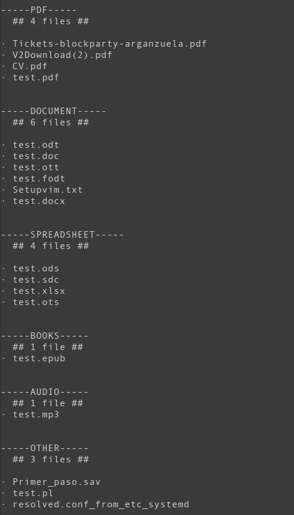
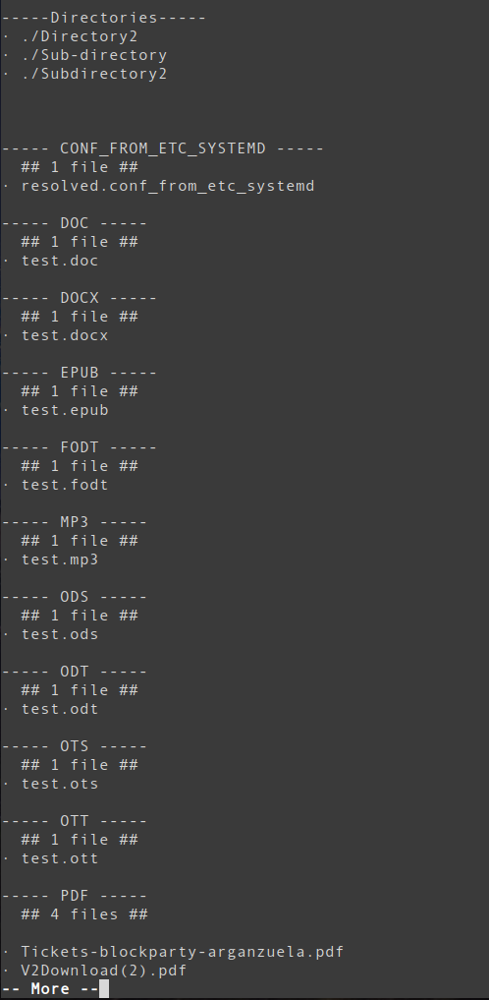
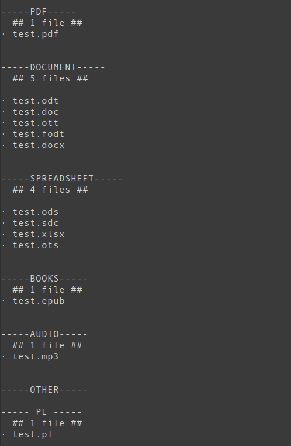

  

### ABOUT
---

This is a simple program written in Perl, which parses through a given directory and returns its files organized by different file groups.

It also accepts different arguments for letting the user:
- decide how the grouping is done,
- choose what information should be shown,
- search for specific names or/and extensions 
- show the subdirectories

The main categories are:
- PDFs
- Documents
- Spreadsheets
- Databases
- E-books
- Audio
- Video
- Email
- Archive/Compressed

The program also shows the number of files for each category. 

### HOW TO USE IT
---

See the section ['Before the first run'](#before-the-first-run) before running the program, elsewhere an error might occur.

Download the `Directory_parser.pl`. 

You can run the program by moving to the downloaded directory and typing: `perl Directory_parser.pl -d <directory>` (replace the \<directory\> with the directory you want to parse).

The -d argument followed by the directory is obligatory and the program will not run without it.
If no more arguments are passed, the program will group the files by default which means that other files will not be grouped by their extension and sub-directories will not be shown. 

The arguments which can be given are: 
- -r \<regex\> Search for a specific file/extension with the use of Regular Expressions. 
- -b Show the sub-directories.
- -a Do not group the files.
- -e Group the files by their extensions (separates similar files, for example xmlx and xml are considered as different extensions).
- -g For the rest of the files that are not found in any of the categories, group them by their extension (like using the -e for the rest of the files).

Run `perl Directory_parser.pl --help` for more help. 

#### Example usages
`perl Directory_parser.pl -d ~/Documents/Example`

`perl Directory_parser.pl -d ~/Documents/Example -e -b`

`perl Directory_parser.pl -d ~/Documents/Example -r test -g`

### Before The First Run
---

Some categories take their extensions from the .txt files included in the `txt_files` directory.

There are two ways to have these files:

1. (Suggested) Download the `web_scraper.pl` at the same directory you have downloaded the `Directory_parser.pl` and run it (`perl web_scraper.pl`). This will automatically create a `txt_files` directory and inside it the necessary .txt files.

    Make sure you have the [LWP::UserAgent](https://metacpan.org/release/RSE/lcwa-1.0.0/view/lib/lwp/lib/LWP/UserAgent.pm) and [IO::Socket::SSL](https://metacpan.org/pod/IO::Socket::SSL) installed. If you face an error try to run the program with admin/sudo privileges.
    
    If the error consists or the files created are empty, move to the second option and please send me a message because the most possible reason is that [File-Extensions.org](https://www.file-extensions.org/) has changed their website's structure and I have to update the webparser.

2. If the first way does not work, create a `txt_files` directory in the same directory you have the `Directory_parser.pl` and download all the `txt` files included in my `txt_files` directory. 

### FUTURE LINES
---
If I will have time in the near future, I will create subcategories that can group programming scripts by their programming language.
